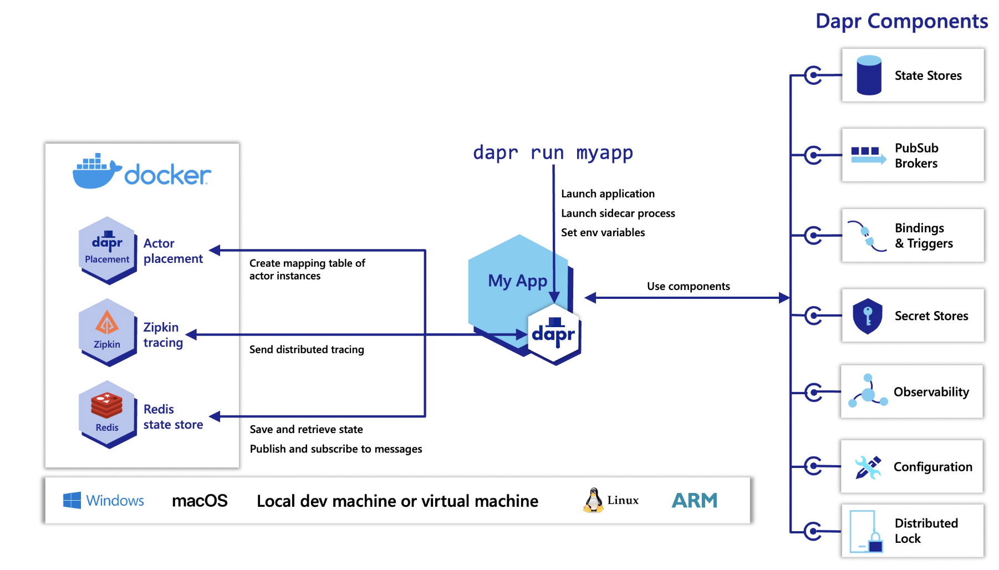

> 实验环境: ubuntu22.10+docker20.10

dapr是一个云原生的微服务平台，称之为平台是因为开发者是通过api与该微服务解决方案进行沟通，而不是让其侵入到业务代码中

dapr可以运行在docker、k8s等基础之上



## 安装daprcli

进入root用户下执行下面的命令

> 需要自己解决下网络问题

```bash
$ wget -q https://raw.githubusercontent.com/dapr/cli/master/install/install.sh -O - | /bin/bash
```

## 初始化

```bash
$ dapr init
```

下载下来运行在docker中的组件包括

- Redis container instance
- Zipkin container instance
- default components folder
- Dapr placement service container instance

## 验证

```bash
$ docker ps
CONTAINER ID   IMAGE                          COMMAND                  CREATED          STATUS                   PORTS                                                 NAMES
ab3c4830e35a   daprio/dapr:1.9.4              "./placement"            14 seconds ago   Up 12 seconds            0.0.0.0:50005->50005/tcp, :::50005->50005/tcp         dapr_placement
3d0b7b74e178   redis:6                        "docker-entrypoint.s…"   47 seconds ago   Up 44 seconds            0.0.0.0:6379->6379/tcp, :::6379->6379/tcp             dapr_redis
0af0af7e65e8   openzipkin/zipkin              "start-zipkin"           2 minutes ago    Up 2 minutes (healthy)   9410/tcp, 0.0.0.0:9411->9411/tcp, :::9411->9411/tcp   dapr_zipkin

$ ls ~/.dapr
bin  components  config.yaml
```

## dashboard

```bash
dapr dashboard -p 9999
```

## hello world

这里定义了两个非常简单的服务，代码详情查看node、python文件夹下

```bash
# 部署
cd use_dapr/01-start/node

npm install

dapr run --app-id nodeapp --app-port 3000 --dapr-http-port 3500 node app.js
```

笑了😂 为啥还必须要本机有node环境哦

```bash
ℹ️  Starting Dapr with id nodeapp. HTTP Port: 3500. gRPC Port: 39513
❌  exec: "node": executable file not found in $PATH
✅  Start App failed, try to stop Dapr successfully
```

也就是说其实这个dapr本质上只是一个运行在容器上的的一个服务，不会管你其他要发布上去的应用是如何打包运行的

- 要么在主机上
- 要么打包成镜像
- 要么打包成wasm

那么我们这里将dapr的内容挂载到code-server中继续测试

重新执行

由于我们这里进入到容器内部了，想要再访问dapr的组件需要更改下endpoint的配置, 进入`~/.dapr/components`修改相关配置文件

```bash
$ cd use_dapr/01-start/node

$ dapr run --app-id nodeapp --app-port 3000 --dapr-http-port 3500 node app.js

ℹ️  Updating metadata for app command: node app.js
✅  You're up and running! Both Dapr and your app logs will appear here.
```

往这个服务中发送消息

```bash
$ cd use_dapr/01-start/node

# 这里可以看到是调用了ndoeapp的neworder方法，传递了文件进去
$ dapr invoke --app-id nodeapp --method neworder --data-file sample.json
✅  App invoked successfully

# 验证情况
$ dapr invoke --app-id nodeapp --method order --verb GET
{"orderId":"42"}
✅  App invoked successfully
```

使用另一个服务验证sidecar

```bash
cd use_dapr/01-start/python

dapr run --app-id pythonapp python app.py

# 测试数据情况
curl http://localhost:3500/v1.0/invoke/nodeapp/method/order -X GET

# 另外我们也可以通过添加dapr-app-id的请求头显示设置访问哪个app
curl localhost:3500/order -H 'dapr-app-id: nodeapp'
```

执行清理操作

```bash
$ dapr stop --app-id nodeapp
```